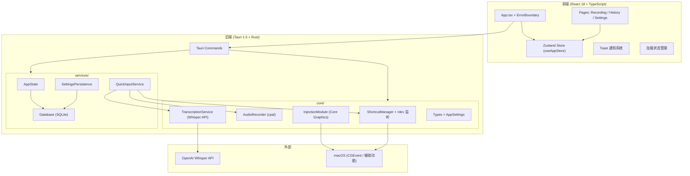
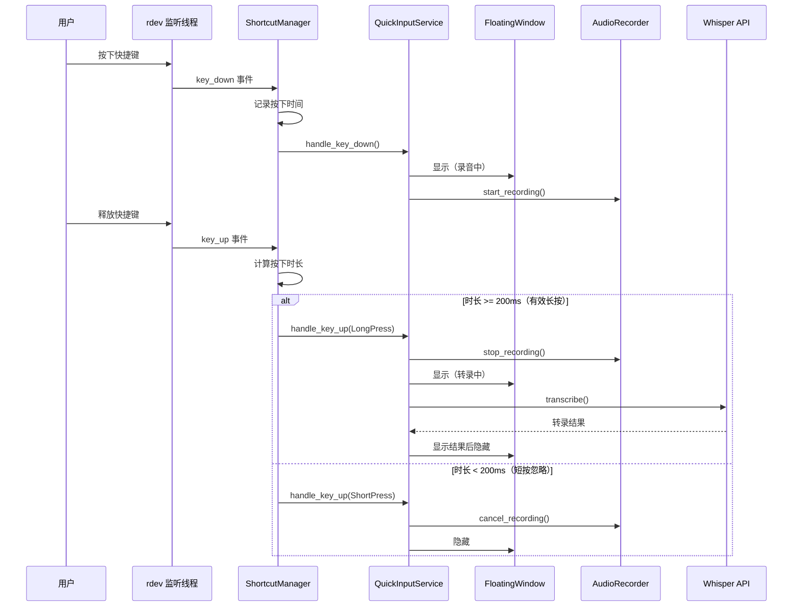

# 设计文档：Recording King v7.0 完善与修复

## 概述

本设计文档覆盖 Recording King v7.0 的 9 项需求，涵盖关键缺陷修复、功能完善、构建修复、错误处理、测试覆盖和代码清理。

项目基于 Tauri 1.5 (Rust 2021) + React 18 + TypeScript 5 + Zustand + Vite 5 技术栈，运行于 macOS 平台。当前代码可编译（11 个警告），前端可构建，但核心的"按住说话"流程因缺少 key-up 检测而无法工作。

### 设计目标

1. 修复按键释放检测，使"按住录音、松开转录"核心流程可用
2. 实现设置持久化，避免每次重启丢失配置
3. 修复 macOS 构建问题，确保可生成 DMG
4. 补充前端错误处理和加载状态管理
5. 建立基础测试覆盖
6. 清理冗余代码和文件
7. 完善快速输入流程和应用生命周期管理

### 设计决策摘要

| 决策 | 选择 | 理由 |
|------|------|------|
| 按键监听方案 | rdev 库 | 跨平台、Rust 原生、API 简洁，支持 key-down/key-up |
| 设置持久化方案 | SQLite（复用现有 Database） | 已有 rusqlite 依赖，无需引入新依赖 |
| API Key 存储 | Base64 编码 + macOS Keychain（可选） | 基础混淆存储，避免明文；Keychain 作为增强选项 |
| 前端错误处理 | React ErrorBoundary + Toast 通知 | ErrorBoundary 捕获渲染异常，Toast 展示操作错误 |
| 前端测试框架 | Vitest + React Testing Library | 与 Vite 生态一致，配置简单 |
| 后端测试框架 | Rust 内置 #[cfg(test)] + 属性测试库 | 无需额外框架 |
| 属性测试库 | proptest (Rust) / fast-check (TypeScript) | 成熟的属性测试库 |

## 架构

### 系统架构图



### 按键监听架构（需求 1）



## 组件与接口

### 需求 1：按键释放检测 — rdev 全局监听模块

新增 `src-tauri/src/core/global_listener.rs`：

```rust
// 核心接口
pub struct GlobalKeyListener {
    running: Arc<AtomicBool>,
    listener_handle: Option<JoinHandle<()>>,
}

impl GlobalKeyListener {
    pub fn new() -> Self;
    
    /// 启动 rdev 全局按键监听，通过 callback 通知 key-down/key-up
    pub fn start<F>(&mut self, target_key: rdev::Key, callback: F) -> Result<()>
    where F: Fn(ShortcutEvent) + Send + 'static;
    
    /// 停止监听并释放资源
    pub fn stop(&mut self) -> Result<()>;
    
    pub fn is_running(&self) -> bool;
}
```

修改 `commands/quick_input.rs`：
- `register_global_shortcut` 改为使用 `GlobalKeyListener` 而非 Tauri `GlobalShortcutManager`
- `unregister_global_shortcut` 调用 `GlobalKeyListener::stop()`

新增依赖：`rdev = "0.5"` 到 `Cargo.toml`

### 需求 2：设置持久化模块

扩展 `services/database.rs`，新增 `app_settings` 表：

```rust
// Database 扩展方法
impl Database {
    pub fn save_settings(&self, settings: &AppSettings) -> Result<()>;
    pub fn load_settings(&self) -> Result<Option<AppSettings>>;
}
```

API Key 存储策略：使用 Base64 编码存储（非明文），字段名 `encrypted_api_key`。

修改 `services/state.rs`：
- `AppState::new()` 启动时调用 `database.load_settings()` 加载已保存设置
- 新增 `AppState::save_settings()` 方法，同时更新内存和持久化

修改 `commands/settings.rs`：
- `update_settings` 命令调用 `AppState::save_settings()` 实现持久化

### 需求 3：macOS 构建修复

- 生成 `src-tauri/icons/icon.icns`（从现有 PNG 图标转换）
- 清理 11 个编译警告：移除未使用的 `use`、变量、死代码
- 验证 `tauri.conf.json` 中所有图标路径引用

### 需求 4：前端错误处理

新增 `src/shared/components/ErrorBoundary.tsx`：

```typescript
interface ErrorBoundaryProps {
  children: React.ReactNode;
  fallback?: React.ReactNode;
}

interface ErrorBoundaryState {
  hasError: boolean;
  error: Error | null;
}

class ErrorBoundary extends React.Component<ErrorBoundaryProps, ErrorBoundaryState> {
  // 捕获渲染异常，显示回退 UI + 重试按钮
}
```

新增 `src/shared/components/Toast.tsx`：

```typescript
interface ToastMessage {
  id: string;
  type: 'success' | 'error' | 'warning' | 'info';
  message: string;
  duration?: number;
}

// Toast 通知组件 + useToast hook
```

扩展 `useAppStore.ts`：
- 新增 `error: string | null` 和 `toasts: ToastMessage[]` 状态
- 新增 `addToast()` / `removeToast()` / `setError()` actions

### 需求 5：加载状态管理

扩展 `useAppStore.ts`：

```typescript
// 新增状态
isInitializing: boolean;
isTranscribing: boolean;
initError: string | null;

// 新增 actions
setInitializing: (value: boolean) => void;
setTranscribing: (value: boolean) => void;
setInitError: (error: string | null) => void;
```

修改 `App.tsx`：
- `initializeApp()` 设置 `isInitializing = true`，完成后设为 `false`
- 初始化期间显示全局 Loading 组件
- 初始化失败显示错误 + 重试按钮

### 需求 6：基础测试覆盖

后端测试文件：
- `src-tauri/src/services/database.rs` 内 `#[cfg(test)] mod tests`
- `src-tauri/src/core/types.rs` 内 `#[cfg(test)] mod tests`
- `src-tauri/src/core/shortcuts.rs` 内 `#[cfg(test)] mod tests`

前端测试文件：
- `src/shared/stores/useAppStore.test.ts`
- `src/features/recording/RecordingPage.test.tsx`
- `src/features/history/HistoryPage.test.tsx`
- `src/features/settings/SettingsPage.test.tsx`

### 需求 7：代码清理

删除列表：
- `old/` 目录
- `src/data/localModels.ts`（确认未使用后删除）
- 空目录：`src/shared/components/`（创建 ErrorBoundary 后不再为空）、`src/shared/hooks/`、`src/styles/`、`src-tauri/src/utils/`
- 根目录遗留文件：`cgevent_test`、`cgevent_test.rs`、`direct_test.py`、`shortcuts_test.py`、`test_api.py`、`test_injection.py`、`LocRecognizerManager.java`
- 根目录过时文档：`SPOKENLY_IMPLEMENTATION_REPORT.md`、`spokenly-clone-docs.md`、`UX_IMPROVEMENTS.md`、`UX_IMPROVEMENTS_SUMMARY.md`、`VOICE_INPUT_FIX.md`
- `docs/` 中与 v7.0 无关的旧文档

### 需求 8：快速输入流程完善

修改 `services/quick_input.rs`：

```rust
impl QuickInputService {
    pub async fn handle_key_up(&self, app_handle: &AppHandle) -> Result<String> {
        // ... 现有转录逻辑 ...
        
        // 新增：保存到历史记录
        let entry = TranscriptionEntry { /* ... */ };
        state.database.save_transcription(&entry)?;
        
        // 新增：FloatingWindow 状态更新
        app_handle.emit_all("quick-input-transcribing", ())?;
        // ... 转录 ...
        app_handle.emit_all("quick-input-result", &result.text)?;
        
        // 新增：错误恢复
        // 录音/转录失败时隐藏 FloatingWindow 并通知前端
    }
}
```

### 需求 9：应用启动与生命周期管理

修改 `main.rs`：

```rust
// setup 闭包中新增：
// 1. 加载持久化设置
let saved_settings = state.database.load_settings();
if let Ok(Some(settings)) = saved_settings {
    *state.settings.lock() = settings;
}

// 2. 自动注册之前配置的快捷键
// 从设置中读取 shortcut_key，调用 GlobalKeyListener::start()

// 3. 检查辅助功能权限
// 调用 core-graphics API 检查权限状态

// on_window_event 中：
// CloseRequested → 隐藏窗口而非退出
.on_window_event(|event| {
    if let tauri::WindowEvent::CloseRequested { api, .. } = event.event() {
        event.window().hide().unwrap();
        api.prevent_close();
    }
})

// system_tray "quit" 事件中：
// 释放 GlobalKeyListener、关闭数据库连接后退出
```

## 数据模型

### AppSettings（扩展）

```rust
#[derive(Debug, Clone, Serialize, Deserialize)]
pub struct AppSettings {
    pub openai_api_key: Option<String>,
    pub selected_model: String,
    pub auto_inject: bool,
    pub inject_delay_ms: u64,
    pub shortcut_key: Option<String>,  // 新增：持久化快捷键配置
}
```

### SQLite Schema（新增 app_settings 表）

```sql
CREATE TABLE IF NOT EXISTS app_settings (
    key TEXT PRIMARY KEY,
    value TEXT NOT NULL,
    updated_at INTEGER NOT NULL
);
```

设置以 key-value 形式存储，`key` 为设置项名称，`value` 为 JSON 序列化值。这样可以灵活扩展设置项而无需修改表结构。

特殊处理：`openai_api_key` 存储时进行 Base64 编码，读取时解码。

### 前端状态扩展（useAppStore）

```typescript
interface AppStore {
  // 现有状态...
  
  // 新增：错误处理
  error: string | null;
  toasts: ToastMessage[];
  
  // 新增：加载状态
  isInitializing: boolean;
  isTranscribing: boolean;
  initError: string | null;
  
  // 新增 actions
  addToast: (toast: Omit<ToastMessage, 'id'>) => void;
  removeToast: (id: string) => void;
  setError: (error: string | null) => void;
  setInitializing: (value: boolean) => void;
  setTranscribing: (value: boolean) => void;
  setInitError: (error: string | null) => void;
}
```

### ToastMessage 类型

```typescript
interface ToastMessage {
  id: string;
  type: 'success' | 'error' | 'warning' | 'info';
  message: string;
  duration?: number; // 默认 3000ms
}
```


## 正确性属性

*属性（Property）是在系统所有有效执行中都应成立的特征或行为——本质上是对系统应做什么的形式化陈述。属性是人类可读规范与机器可验证正确性保证之间的桥梁。*

### Property 1: ShortcutManager 按键状态往返

*For any* ShortcutManager 实例处于未按下状态，调用 `handle_key_down()` 后再调用 `handle_key_up()`，管理器应回到未按下状态（`is_pressed() == false`），且 `press_start` 应为 `None`。

**Validates: Requirements 1.1, 1.2**

### Property 2: 按键时长阈值决定事件类型

*For any* 按键按下时长 `d`，当 `d >= 200ms` 时 `handle_key_up()` 应返回 `LongPress(d)`，当 `d < 200ms` 时应返回 `KeyUp`。即事件类型完全由按下时长与阈值的比较决定。

**Validates: Requirements 1.4, 1.5**

### Property 3: AppSettings 数据库持久化往返

*For any* 有效的 `AppSettings` 对象，调用 `database.save_settings(settings)` 后再调用 `database.load_settings()`，应返回与原始对象等价的 `AppSettings`（API Key 经编码/解码后值相同）。

**Validates: Requirements 2.1, 2.2**

### Property 4: API Key 非明文存储

*For any* 非空的 OpenAI API Key 字符串，保存到数据库后，数据库中 `app_settings` 表中 `openai_api_key` 对应的 `value` 字段不应等于原始明文 Key。

**Validates: Requirements 2.4**

### Property 5: AppSettings 序列化往返

*For any* 有效的 `AppSettings` 对象，使用 `serde_json::to_string()` 序列化后再用 `serde_json::from_str()` 反序列化，应产生与原始对象等价的 `AppSettings`。

**Validates: Requirements 6.7**

### Property 6: ErrorBoundary 捕获渲染异常

*For any* 在 ErrorBoundary 内部抛出异常的子组件，ErrorBoundary 应捕获该异常并渲染包含错误描述文本和重试按钮的回退界面，而非导致整个应用崩溃。

**Validates: Requirements 4.2**

### Property 7: Tauri 命令错误在 UI 中可见

*For any* 失败的 Tauri command 调用（录音、转录、设置保存等），前端应在界面上渲染包含错误信息的可见元素（Toast 或内联错误提示），而非仅输出到 console。

**Validates: Requirements 4.3**

### Property 8: 加载指示器与初始化状态同步

*For any* `isInitializing` 状态值，当 `isInitializing === true` 时全局加载指示器应可见且主内容应隐藏，当 `isInitializing === false` 时加载指示器应隐藏且主内容应可见。

**Validates: Requirements 5.1, 5.4**

### Property 9: 转录中禁用录音按钮

*For any* `isTranscribing === true` 的状态，录音按钮应处于 `disabled` 状态且应显示转录进度指示器。

**Validates: Requirements 5.3**

### Property 10: 快速输入转录结果持久化到历史

*For any* 通过快速输入流程完成的转录结果，该结果应出现在 `database.get_history()` 返回的列表中，且文本内容与转录结果一致。

**Validates: Requirements 8.1**

## 错误处理

### 后端错误处理

| 错误场景 | 处理方式 | 用户影响 |
|----------|----------|----------|
| rdev 监听线程崩溃 | 记录错误日志，emit `shortcut-listener-failed` 事件 | 前端显示"快捷键监听已失效"Toast |
| 数据库连接失败 | 使用默认设置，记录警告日志 | 设置不持久化，历史记录不可用 |
| API Key 未设置 | 返回 `AppError::Other("API key not set")` | 前端提示配置 API Key |
| 录音设备不可用 | 返回 `AppError::Audio(...)` | 前端显示设备错误详情 |
| 转录 API 失败 | 返回 `AppError::Transcription(...)` 或 `AppError::Network(...)` | 前端显示具体失败原因 |
| 文本注入权限不足 | 返回 `AppError::Permission(...)` | 前端提示授权辅助功能 |
| 设置保存失败 | 返回 `AppError::Database(...)` | 前端显示保存失败 Toast |

### 前端错误处理

| 层级 | 机制 | 覆盖范围 |
|------|------|----------|
| 全局 | ErrorBoundary | 捕获所有未处理的渲染异常，显示回退 UI |
| 操作级 | Toast 通知 | Tauri command 失败时显示用户可理解的错误消息 |
| 页面级 | 内联错误提示 | 录音/转录/注入失败时在对应页面显示具体原因 |
| 验证级 | 前置检查 | API Key 未设置时阻止转录并引导到设置页 |

### 错误消息映射

```typescript
const ERROR_MESSAGES: Record<string, string> = {
  'API key not set': '请先在设置页面配置 OpenAI API Key',
  'Audio error': '录音设备错误，请检查麦克风连接和权限',
  'Permission denied': '辅助功能权限未授权，请在系统偏好设置中授权',
  'Network error': '网络连接失败，请检查网络设置',
  'Transcription error': '转录失败，请检查 API Key 是否有效',
};
```

## 测试策略

### 双重测试方法

本项目采用单元测试 + 属性测试的双重测试策略：

- **单元测试**：验证具体示例、边界情况和错误条件
- **属性测试**：验证跨所有输入的通用属性

两者互补，单元测试捕获具体 bug，属性测试验证通用正确性。

### 后端测试（Rust）

**框架**：Rust 内置 `#[cfg(test)]` + `proptest` 属性测试库

**属性测试配置**：
- 每个属性测试最少运行 100 次迭代
- 每个测试用注释标注对应的设计属性
- 标注格式：`// Feature: recording-king-v7-completion, Property {number}: {property_text}`

**测试文件与覆盖范围**：

| 模块 | 测试类型 | 覆盖内容 |
|------|----------|----------|
| `core/shortcuts.rs` | 属性测试 | Property 1（状态往返）、Property 2（时长阈值） |
| `core/types.rs` | 属性测试 | Property 5（AppSettings 序列化往返） |
| `services/database.rs` | 属性测试 + 单元测试 | Property 3（设置持久化往返）、Property 4（API Key 非明文）、CRUD 操作、搜索功能 |
| `services/database.rs` | 单元测试 | 数据库损坏/不存在时使用默认设置（边界情况 2.3） |
| `core/audio.rs` | 单元测试 | RecordingConfig 验证 |

**属性测试实现要求**：
- 每个正确性属性由一个属性测试实现
- 使用 `proptest!` 宏定义测试
- 为 `AppSettings` 实现 `Arbitrary` trait 或使用 `prop_compose!` 生成器

### 前端测试（TypeScript）

**框架**：Vitest + React Testing Library + `fast-check` 属性测试库

**属性测试配置**：
- 每个属性测试最少运行 100 次迭代（`fc.assert(property, { numRuns: 100 })`）
- 每个测试用注释标注对应的设计属性
- 标注格式：`// Feature: recording-king-v7-completion, Property {number}: {property_text}`

**测试文件与覆盖范围**：

| 文件 | 测试类型 | 覆盖内容 |
|------|----------|----------|
| `src/shared/components/ErrorBoundary.test.tsx` | 属性测试 | Property 6（ErrorBoundary 捕获异常） |
| `src/shared/stores/useAppStore.test.ts` | 属性测试 + 单元测试 | Property 7（错误可见性）、所有 action 覆盖 |
| `src/App.test.tsx` | 属性测试 | Property 8（加载指示器同步） |
| `src/features/recording/RecordingPage.test.tsx` | 属性测试 + 单元测试 | Property 9（转录中禁用按钮）、渲染测试 |
| `src/features/history/HistoryPage.test.tsx` | 单元测试 | 基础渲染测试 |
| `src/features/settings/SettingsPage.test.tsx` | 单元测试 | 基础渲染测试、保存成功/失败提示 |

### 新增依赖

**后端**（Cargo.toml dev-dependencies）：
```toml
[dev-dependencies]
proptest = "1.4"
tempfile = "3.9"
```

**前端**（package.json devDependencies）：
```json
{
  "vitest": "^1.0",
  "@testing-library/react": "^14.0",
  "@testing-library/jest-dom": "^6.0",
  "fast-check": "^3.15",
  "jsdom": "^23.0"
}
```
