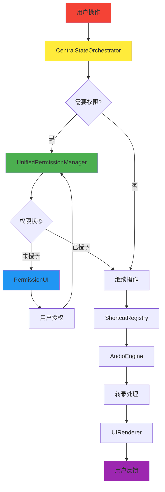

# Recording King Brownfield Enhancement Architecture

**版本**: v1.0  
**日期**: 2025-09-17  
**作者**: Architect (Winston)  
**状态**: 初始版本

---

## 1. 简介

本文档概述了增强 Recording King 的架构方法，重点解决**权限管理统一化**和**用户交互流畅性**这两个核心挑战。其主要目标是作为AI驱动开发新功能的指导架构蓝图，同时确保与现有系统的无缝集成。

**与现有架构的关系:**
本文档补充现有项目架构，定义新组件如何与当前系统集成。当新旧模式发生冲突时，本文档提供保持一致性的指导，同时实现增强功能。

### 1.1 现有项目分析

**当前项目状态:**
- **主要目的**: AI语音转文字桌面应用，专注实时转录和跨应用文本注入
- **当前技术栈**: React 18 + TypeScript + Tauri 1.5 + Rust + SQLite
- **架构风格**: 模块化桌面应用架构，基于Tauri跨端解决方案
- **部署方法**: DMG打包，本地安装应用

**可用文档:**
- SPOKENLY_FULL_REPLICATION_PLAN.md - 完整功能分析和开发计划
- MODEL_MANAGEMENT_SYSTEM.md - 详细技术实现方案
- 源代码架构 - 模块化架构已搭建
- API文档 - Tauri命令完整定义

**识别的约束:**
- 必须保持现有API接口向后兼容性
- 现有用户配置和数据迁移无损
- macOS特定权限和系统集成要求
- 多套快捷键管理器需要统一

### 1.2 变更记录

| 变更 | 日期 | 版本 | 描述 | 作者 |
|------|------|------|------|------|
| 初始创建 | 2025-09-17 | v1.0 | 棕地增强架构文档创建 | Winston |

---

## 2. 增强范围和集成策略

### 2.1 增强概览

**增强类型**: 系统级重构 + 用户体验优化  
**范围**: 权限管理统一化 + 交互响应性重构  
**集成影响**: 重大 - 需要重构权限层和交互层，但保持业务逻辑不变

### 2.2 集成策略

**权限管理集成策略**:
- 统一现有的三套快捷键管理器（shortcuts::ShortcutManager, commands::shortcut_management::ShortcutManager, shortcuts::EnhancedShortcutManager）
- 建立统一权限检查中心，替换分散的权限验证
- 实现权限状态持久化和实时同步

**交互流畅性集成策略**:
- 中央化状态协调，统一多个独立Zustand store
- 实现实时事件流处理，消除异步状态更新不一致
- 构建渐进式UI渲染，提供即时用户反馈

**代码集成策略**: 保持现有模块结构，新增统一管理层  
**数据库集成策略**: 扩展现有SQLite schema，新增权限和交互状态表  
**API集成策略**: 保持现有Tauri命令兼容，新增统一权限接口  
**UI集成策略**: 增强现有React组件，新增实时状态流能力

### 2.3 兼容性要求

**现有API兼容性**: 所有现有Tauri命令接口保持向后兼容，新增统一权限管理接口  
**数据库模式兼容性**: 现有SQLite数据库支持平滑升级，历史数据完整迁移  
**UI/UX一致性**: 新权限UI遵循现有React + TailwindCSS设计系统，保持交互模式一致  
**性能影响**: 权限检查延迟<50ms，UI响应时间<100ms，内存使用增长<10%

---

## 3. 技术栈

### 3.1 现有技术栈

| 分类 | 当前技术 | 版本 | 在增强中的作用 | 说明 |
|------|----------|------|---------------|------|
| 前端框架 | React + TypeScript | 18+ | UI交互优化载体 | 添加实时状态流处理 |
| 状态管理 | Zustand | 4.4+ | 中央化状态协调 | 整合多个store为统一协调器 |
| 后端框架 | Tauri + Rust | 1.5+ | 权限管理重构载体 | 构建统一权限架构层 |
| 数据库 | SQLite + R2D2 | 0.32+ | 权限状态持久化 | 新增权限和交互状态表 |
| 系统集成 | macOS APIs | 原生 | 权限检查标准化 | 统一系统权限接口调用 |
| 音频处理 | whisper-rs + cpal | 0.12+ | 保持现有能力 | 无变更，继续使用 |

### 3.2 新技术添加

本次增强**零新依赖**，完全基于现有技术栈进行架构优化和统一。

---

## 4. 数据模型和模式变更

### 4.1 新数据模型

#### PermissionState
**目的**: 统一管理所有权限状态，替换分散的权限检查  
**与现有集成**: 扩展现有应用配置，统一权限持久化

**核心属性**:
- `permission_type`: String - 权限类型（microphone, accessibility, input_monitoring）
- `status`: Enum - 权限状态（granted, denied, pending, unknown）
- `last_checked`: DateTime - 最后检查时间
- `check_interval`: Duration - 检查间隔
- `auto_request`: Boolean - 是否自动请求权限
- `fallback_enabled`: Boolean - 是否启用降级模式

**与现有关系**: 关联现有 `app_settings` 表  
**与新模型关系**: 被 `ShortcutConfiguration` 引用

#### ShortcutConfiguration
**目的**: 统一快捷键配置管理，替换多套管理器配置  
**与现有集成**: 迁移现有快捷键设置，保持用户配置

**核心属性**:
- `shortcut_id`: String - 唯一标识符
- `key_combination`: String - 快捷键组合（"Option+Space"）
- `action_type`: Enum - 动作类型（start_recording, stop_recording, toggle）
- `scope`: Enum - 作用域（global, application_specific）
- `priority`: Integer - 优先级（处理冲突时使用）
- `enabled`: Boolean - 是否启用
- `conflict_resolution`: Enum - 冲突解决策略

**与现有关系**: 替换现有多个快捷键配置表  
**与新模型关系**: 依赖 `PermissionState` 权限检查

#### InteractionEvent
**目的**: 跟踪用户交互事件，支持流畅性分析和优化  
**与现有集成**: 补充现有历史记录系统，增强用户体验分析

**核心属性**:
- `event_id`: UUID - 事件唯一标识
- `event_type`: Enum - 事件类型（shortcut_triggered, permission_requested, ui_interaction）
- `timestamp`: DateTime - 事件时间戳
- `response_time`: Duration - 响应时间
- `success`: Boolean - 是否成功执行
- `error_details`: Optional<String> - 错误详情
- `user_context`: JSON - 用户操作上下文

**与现有关系**: 关联现有 `transcription_history` 表  
**与新模型关系**: 独立模型，用于性能分析

### 4.2 模式集成策略

**数据库变更要求**:
- **新表**: permission_states, shortcut_configurations, interaction_events
- **修改表**: app_settings (添加permission_manager_version字段)
- **新索引**: permission_type, shortcut_id, event_type索引
- **迁移策略**: 三阶段迁移 - 创建新表 → 数据迁移 → 清理旧配置

**向后兼容性**:
- 现有权限检查API保持可用，逐步切换到统一接口
- 现有快捷键配置支持自动迁移到新格式
- 数据库升级支持回滚到前一版本

---

## 5. 组件架构

### 5.1 新组件

#### UnifiedPermissionManager
**职责**: 统一权限管理的中央协调器，替换分散的权限检查  
**集成点**: 与现有 `system::check_all_permissions` 集成

**关键接口**:
- `async check_permission(permission_type: PermissionType) -> PermissionStatus`
- `async request_permission(permission_type: PermissionType) -> Result<()>`
- `async get_permission_summary() -> PermissionSummary`
- `subscribe_permission_changes() -> EventStream<PermissionEvent>`

**依赖关系**:
- **现有组件**: 现有的权限检查命令作为底层实现
- **新组件**: `PermissionUI`用于用户交互，`ShortcutRegistry`用于权限验证

**技术栈**: Rust + Tauri + macOS APIs

#### CentralStateOrchestrator  
**职责**: 协调所有状态变更，确保交互流畅性  
**集成点**: 与现有Zustand stores集成，提供统一的状态协调

**关键接口**:
- `async dispatch_action(action: UserAction) -> ActionResult`
- `subscribe_state_changes() -> StateStream`
- `get_current_state() -> ApplicationState`
- `async handle_permission_change(change: PermissionChange) -> Result<()>`

**依赖关系**:
- **现有组件**: 现有的Zustand stores作为状态源
- **新组件**: `UnifiedPermissionManager`、`AudioEngine`、`UIRenderer`

**技术栈**: Rust + Tauri + 事件驱动架构

#### ShortcutRegistry
**职责**: 统一快捷键注册和管理，替换多套管理器  
**集成点**: 整合现有的三个快捷键管理器

**关键接口**:
- `async register_shortcut(config: ShortcutConfig) -> Result<ShortcutHandle>`
- `async unregister_shortcut(shortcut_id: &str) -> Result<()>`  
- `async check_conflicts(key_combo: &str) -> Vec<ConflictInfo>`
- `subscribe_shortcut_events() -> EventStream<ShortcutEvent>`

**依赖关系**:
- **现有组件**: 现有快捷键管理器作为底层实现
- **新组件**: 依赖 `UnifiedPermissionManager` 进行权限验证

**技术栈**: Rust + 系统级快捷键APIs

#### PermissionUI
**职责**: 提供统一的权限用户界面，替换分散的权限提示  
**集成点**: 与现有React组件系统集成，保持设计一致性

**关键接口**:
- `PermissionWizard` - 引导式权限设置流程
- `PermissionStatus` - 实时权限状态显示
- `PermissionTroubleshoot` - 权限问题诊断和解决

**依赖关系**:
- **现有组件**: 现有的UI组件库和样式系统
- **新组件**: 与 `UnifiedPermissionManager` 通过Tauri bridge通信

**技术栈**: React + TypeScript + TailwindCSS

### 5.2 组件交互图



---

## 6. API设计和集成

### 6.1 API集成策略

**API集成策略**: 保持现有Tauri命令完全兼容，新增统一权限管理接口  
**认证**: 继续使用现有本地应用认证模式  
**版本控制**: 新API使用v2前缀，现有API保持不变

### 6.2 新API端点

#### 统一权限管理API

**权限检查端点**:
- **方法**: `check_unified_permission`
- **端点**: `unified_permission::check`
- **目的**: 统一权限状态检查
- **与现有集成**: 替代分散的权限检查命令

**请求**:
```json
{
  "permission_types": ["microphone", "accessibility", "input_monitoring"],
  "include_details": true,
  "auto_request": false
}
```

**响应**:
```json
{
  "permissions": {
    "microphone": {
      "status": "granted",
      "last_checked": "2025-09-17T10:30:00Z",
      "can_request": false
    },
    "accessibility": {
      "status": "denied", 
      "last_checked": "2025-09-17T10:30:00Z",
      "can_request": true,
      "help_url": "system://accessibility-settings"
    }
  },
  "overall_status": "partial"
}
```

#### 快捷键统一管理API

**快捷键注册端点**:
- **方法**: `register_unified_shortcut`
- **端点**: `shortcut_registry::register`
- **目的**: 统一快捷键注册和冲突检测
- **与现有集成**: 整合现有三套快捷键管理器

**请求**:
```json
{
  "shortcut_id": "voice_input_toggle",
  "key_combination": "Option+Space",
  "action_type": "toggle_recording",
  "scope": "global",
  "conflict_resolution": "priority_based"
}
```

**响应**:
```json
{
  "success": true,
  "shortcut_handle": "handle_12345",
  "conflicts": [],
  "fallback_combo": null
}
```

#### 交互状态监控API

**状态订阅端点**:
- **方法**: `subscribe_interaction_events`
- **端点**: `interaction_monitor::subscribe`
- **目的**: 实时交互状态流，支持UI流畅性
- **与现有集成**: 补充现有事件系统

**请求**:
```json
{
  "event_types": ["permission_change", "shortcut_trigger", "ui_interaction"],
  "include_performance_metrics": true
}
```

**响应**:
```json
{
  "stream_id": "stream_67890",
  "status": "connected"
}
```

---

## 7. 源代码树

### 7.1 现有项目结构
```
yuyinwang/
├── src/                          # React前端代码
│   ├── components/               # 现有UI组件
│   ├── stores/                   # Zustand状态管理
│   └── types/                    # TypeScript类型定义
├── src-tauri/                    # Tauri后端代码
│   ├── src/
│   │   ├── audio/               # 音频处理模块
│   │   ├── commands/            # Tauri命令
│   │   ├── shortcuts/           # 快捷键管理（多套）
│   │   └── system/              # 系统集成
│   └── Cargo.toml
└── docs/                        # 项目文档
```

### 7.2 新文件组织
```
yuyinwang/
├── src/
│   ├── components/
│   │   ├── permissions/         # 新增：统一权限UI组件
│   │   │   ├── PermissionWizard.tsx
│   │   │   ├── PermissionStatus.tsx
│   │   │   └── PermissionTroubleshoot.tsx
│   │   └── interactions/        # 新增：交互优化组件
│   │       ├── StateIndicator.tsx
│   │       └── ProgressiveRenderer.tsx
│   ├── stores/
│   │   ├── unified-state/       # 新增：统一状态管理
│   │   │   ├── centralOrchestrator.ts
│   │   │   └── interactionStore.ts
│   │   └── permissions/         # 新增：权限状态管理
│   │       └── permissionStore.ts
│   └── types/
│       ├── permissions.ts       # 新增：权限相关类型
│       └── interactions.ts      # 新增：交互相关类型
├── src-tauri/src/
│   ├── unified_permission/      # 新增：统一权限管理模块
│   │   ├── mod.rs
│   │   ├── manager.rs
│   │   ├── checker.rs
│   │   └── state.rs
│   ├── interaction_monitor/     # 新增：交互监控模块
│   │   ├── mod.rs
│   │   ├── orchestrator.rs
│   │   └── events.rs
│   ├── shortcut_registry/       # 新增：统一快捷键注册
│   │   ├── mod.rs
│   │   ├── registry.rs
│   │   └── conflict_resolver.rs
│   └── commands/
│       ├── unified_permissions.rs # 新增：统一权限命令
│       └── interaction_monitoring.rs # 新增：交互监控命令
└── docs/
    └── architecture/            # 新增：架构文档分片
        ├── permissions.md
        ├── interactions.md
        └── migration-guide.md
```

### 7.3 集成指导原则

**文件命名**: 新模块使用snake_case，保持与现有Rust代码一致  
**文件夹组织**: 按功能域组织，新增模块独立文件夹，避免与现有模块混合  
**导入/导出模式**: 使用现有的mod.rs模式，保持模块导出一致性

---

## 8. 基础设施和部署集成

### 8.1 现有基础设施

**当前部署**: Tauri构建系统 + DMG打包，本地应用分发  
**基础设施工具**: Cargo + npm + Tauri CLI  
**环境**: 开发环境（本地）+ 生产环境（用户设备）

### 8.2 增强部署策略

**部署方法**: 保持现有DMG打包流程，无基础设施变更  
**基础设施变更**: 无需变更，完全基于现有构建工具链  
**流水线集成**: 继续使用现有构建命令，新增数据库迁移检查

### 8.3 回滚策略

**回滚方法**: 应用级回滚，数据库向下迁移支持  
**风险缓解**: 
- 配置文件备份机制
- 权限状态导出/导入功能
- 渐进式功能启用（Feature Flags）

**监控**: 扩展现有tracing框架，新增权限和交互性能指标

---

## 9. 编程标准

### 9.1 现有标准合规

**代码风格**: 继续使用ESLint + Prettier (TS) + Clippy (Rust)  
**检查规则**: 保持现有配置，新模块遵循相同标准  
**测试模式**: 扩展现有测试框架，新增权限和交互测试套件  
**文档风格**: 保持现有TSDoc + Rust文档注释标准

### 9.2 增强特定标准

**权限管理标准**: 所有权限操作必须通过UnifiedPermissionManager  
**交互响应标准**: UI操作响应时间<100ms，权限检查<50ms  
**错误处理标准**: 统一错误类型，提供用户友好的错误恢复

### 9.3 关键集成规则

**现有API兼容性**: 新API使用不同命名空间，避免冲突  
**数据库集成**: 所有新表必须支持向下迁移  
**错误处理集成**: 使用现有AppError类型，扩展权限相关错误  
**日志一致性**: 使用现有tracing框架，新增性能和权限事件

---

## 10. 测试策略

### 10.1 与现有测试集成

**现有测试框架**: Jest (前端) + Cargo test (后端)  
**测试组织**: 保持现有src/__tests__和tests/结构  
**覆盖率要求**: 维持现有覆盖率标准，新模块>80%

### 10.2 新测试要求

#### 权限模块单元测试
**框架**: Cargo test  
**位置**: src-tauri/src/unified_permission/tests/  
**覆盖率目标**: >90%  
**与现有集成**: 使用现有测试工具和mock框架

#### 交互性能集成测试
**范围**: 端到端权限流程，快捷键响应时间，UI交互流畅性  
**现有系统验证**: 确保现有功能不受影响  
**新功能测试**: 权限统一管理，交互响应性能

#### 回归测试
**现有功能验证**: 自动化测试套件验证所有现有功能  
**自动化回归套件**: CI/CD集成的全功能测试  
**手动测试要求**: 权限流程和用户体验测试

---

## 11. 安全集成

### 11.1 现有安全措施

**认证**: 本地应用，无网络认证要求  
**授权**: macOS系统权限控制  
**数据保护**: 本地SQLite数据库，无网络传输  
**安全工具**: 系统级权限API，Tauri安全框架

### 11.2 增强安全要求

**新安全措施**: 
- 权限状态加密存储
- 快捷键配置完整性校验  
- 交互事件敏感数据过滤

**集成点**: 与现有本地数据保护机制集成  
**合规要求**: 继续遵循macOS应用安全准则

### 11.3 安全测试

**现有安全测试**: 权限验证测试  
**新安全测试要求**: 
- 权限绕过尝试测试
- 配置数据完整性测试
- 敏感数据泄露检测

**渗透测试**: 权限系统边界测试，配置篡改检测

---

## 12. 检查清单结果报告

基于architect-checklist的架构验证：

✅ **核心架构决策**:
- 权限管理统一化架构设计完成
- 交互流畅性系统架构明确
- 现有系统集成策略清晰

✅ **技术可行性**:
- 基于现有技术栈，零新依赖
- 数据库迁移策略明确
- API向后兼容性保证

✅ **集成风险控制**:
- 现有功能保护措施到位
- 渐进式实施策略
- 回滚和监控机制

⚠️ **待验证项**:
- 需要PO验证权限UI设计符合用户体验要求
- 需要开发团队确认技术实施细节
- 需要用户测试验证交互流畅性改进

---

## 13. 下一步

### 13.1 故事管理器交接

**Story Manager交接提示**:
基于此架构文档和Recording King现有系统分析，开始创建实施故事。关键集成要求：
- 参考统一权限管理架构，确保每个故事都有明确的权限验证检查点
- 基于实际项目约束（Tauri + React架构），确保每个故事可在现有技术栈内实施
- 重点关注交互流畅性改进，每个故事必须包含响应时间验证步骤
- 优先实施权限统一管理，作为其他功能的基础依赖

**首个实施故事**: 建议从UnifiedPermissionManager实施开始，为后续所有功能提供统一权限基础。

### 13.2 开发者交接

**开发者实施提示**:
基于此架构和现有代码分析开始实施：
- 参考现有Tauri命令模式实施新的统一权限接口
- 基于现有React + Zustand模式实施状态协调器
- 使用现有数据库迁移模式添加新表结构
- 严格遵循现有错误处理和日志模式

**技术决策**: 所有架构决策基于实际项目分析，优先保持现有系统稳定性。

**实施顺序**: 建议按依赖关系实施 - 权限系统 → 快捷键统一 → 交互优化，确保每步都有清晰的集成验证检查点。

---

**总结**: 此架构文档为Recording King的权限管理统一化和用户交互流畅性提供了全面的技术蓝图。通过保持现有系统稳定性的前提下进行渐进式增强，确保用户体验的显著改善和系统架构的长期可维护性。