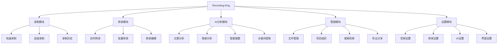
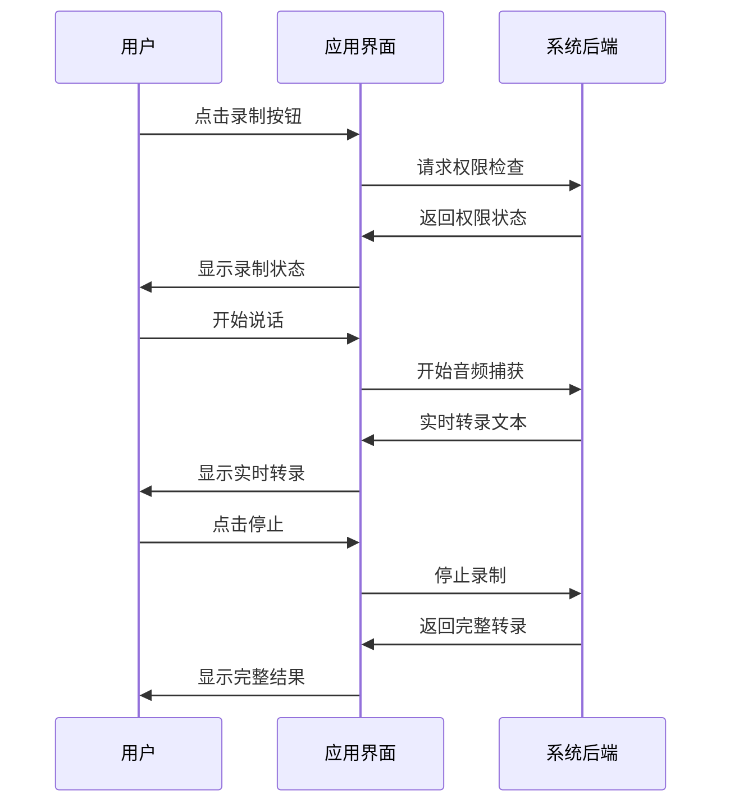
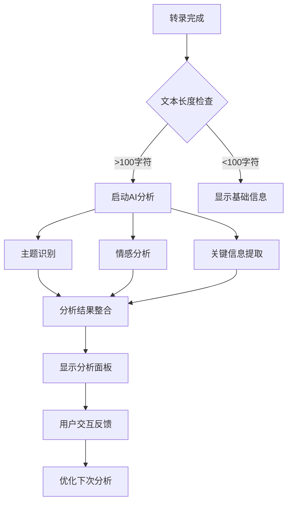

# Recording King - 前端UX/UI规范文档
## 生产级用户体验设计方案

**版本**: 2.0  
**创建日期**: 2025-09-18  
**最后更新**: 2025-09-18  
**负责人**: UX团队 & 开发团队  

---

## 📋 目录

1. [介绍与UX目标](#1-介绍与ux目标)
2. [用户研究与画像](#2-用户研究与画像)
3. [信息架构](#3-信息架构)
4. [核心用户流程](#4-核心用户流程)
5. [设计系统与组件库](#5-设计系统与组件库)
6. [界面布局与线框图](#6-界面布局与线框图)
7. [交互设计](#7-交互设计)
8. [响应式设计策略](#8-响应式设计策略)
9. [可访问性要求](#9-可访问性要求)
10. [性能与优化](#10-性能与优化)
11. [实施路线图](#11-实施路线图)

---

## 1. 介绍与UX目标

### 🎯 产品愿景
Recording King 致力于成为最直观、最强大的语音转录和AI增强处理平台，让用户能够effortlessly地将语音转化为有价值的文本内容。

### 🌟 核心UX原则

#### 1.1 Effortless Recording（无缝录制）
- **一键启动**: 用户应能在3秒内开始录制
- **智能状态**: 清晰的视觉反馈，用户始终了解系统状态
- **零干扰**: 录制过程不影响用户的其他工作流

#### 1.2 Intelligent Processing（智能处理）
- **实时反馈**: 转录和分析结果实时显示，无需等待
- **渐进式增强**: 从基础转录到AI增强，逐步展现更多价值
- **可控智能**: AI功能可配置，用户保持控制权

#### 1.3 Professional Grade（专业级别）
- **企业级稳定性**: 99.9%可用性，支持长时间使用
- **数据安全**: 用户数据隐私保护优先
- **多场景适配**: 会议、访谈、个人笔记等不同使用场景

### 🎨 设计原则

1. **Content First**: 内容为王，界面为内容服务
2. **Progressive Disclosure**: 渐进式信息披露，避免认知过载
3. **Consistent Interactions**: 一致的交互模式，降低学习成本
4. **Delightful Details**: 精心设计的微交互，提升使用愉悦感

---

## 2. 用户研究与画像

### 👥 主要用户群体

#### 2.1 商务专业人士 (40%)
- **典型场景**: 会议记录、客户访谈、项目讨论
- **核心需求**: 快速、准确、可分享的会议纪要
- **痛点**: 手动记录效率低，重要信息遗漏
- **期望**: 自动化程度高，支持团队协作

#### 2.2 内容创作者 (30%)
- **典型场景**: 播客录制、采访转录、创意brainstorm
- **核心需求**: 高质量转录，支持后期编辑
- **痛点**: 转录质量不稳定，编辑工作量大
- **期望**: AI辅助编辑，多格式导出

#### 2.3 学术研究者 (20%)
- **典型场景**: 讲座记录、研究访谈、学术会议
- **核心需求**: 精确转录，支持引用和检索
- **痛点**: 专业术语识别困难，组织结构复杂
- **期望**: 智能分类，知识图谱构建

#### 2.4 个人用户 (10%)
- **典型场景**: 个人日记、想法记录、学习笔记
- **核心需求**: 简单易用，个人化体验
- **痛点**: 功能过于复杂，学习成本高
- **期望**: 极简界面，智能建议

---

## 3. 信息架构

### 🗂️ 核心功能模块



### 🧭 导航结构

#### 主导航 (Top Level)
1. **仪表板** - 快速概览和快捷操作
2. **录制** - 核心录制功能
3. **文件** - 文件管理和浏览
4. **分析** - AI分析和洞察
5. **设置** - 系统配置

#### 次级导航 (Contextual)
- 各模块内的功能分组
- 动态面包屑导航
- 快捷键和手势支持

---

## 4. 核心用户流程

### 🎬 Flow 1: 快速录制流程



**关键时点**:
- 录制启动 < 2秒
- 实时转录延迟 < 1秒
- 停止响应 < 1秒

### 🎬 Flow 2: AI分析流程



**用户期望**:
- 分析结果在转录完成后3秒内显示
- 分析准确率 > 85%
- 支持用户反馈改进

### 🎬 Flow 3: 文件管理流程

用户需要能够:
1. 快速浏览历史录制
2. 高效搜索和过滤
3. 组织和分类文件
4. 导出和分享内容

---

## 5. 设计系统与组件库

### 🎨 品牌色彩系统

#### 主色调 (Primary Colors)
```css
--brand-primary: #2563eb;      /* 专业蓝 - 主要操作 */
--brand-primary-light: #3b82f6; /* 浅蓝 - 悬停状态 */
--brand-primary-dark: #1d4ed8;  /* 深蓝 - 激活状态 */
```

#### 功能色彩 (Functional Colors)
```css
--success: #10b981;     /* 成功状态 - 录制完成 */
--warning: #f59e0b;     /* 警告状态 - 权限提醒 */
--error: #ef4444;       /* 错误状态 - 录制失败 */
--info: #06b6d4;        /* 信息状态 - AI分析 */
```

#### 中性色彩 (Neutral Colors)
```css
--gray-50: #f9fafb;     /* 背景色 */
--gray-100: #f3f4f6;    /* 卡片背景 */
--gray-500: #6b7280;    /* 次要文本 */
--gray-900: #111827;    /* 主要文本 */
```

### 🔤 字体系统

#### 字体族
- **中文**: 'PingFang SC', 'Microsoft YaHei', sans-serif
- **英文**: 'Inter', 'Segoe UI', sans-serif
- **代码**: 'JetBrains Mono', 'Fira Code', monospace

#### 字体层级
```css
.text-4xl { font-size: 2.25rem; line-height: 2.5rem; }  /* 页面标题 */
.text-2xl { font-size: 1.5rem; line-height: 2rem; }    /* 区块标题 */
.text-lg { font-size: 1.125rem; line-height: 1.75rem; } /* 强调文本 */
.text-base { font-size: 1rem; line-height: 1.5rem; }   /* 正文 */
.text-sm { font-size: 0.875rem; line-height: 1.25rem; } /* 辅助文本 */
```

### 🧩 核心组件

#### 5.1 录制控制组件

**RecordingButton**
- 状态: 待机 / 录制中 / 暂停 / 处理中
- 视觉反馈: 颜色变化 + 脉冲动画 + 波形显示
- 交互: 点击录制，长按显示选项

```jsx
<RecordingButton
  state="recording" // idle | recording | paused | processing
  onRecord={() => {}}
  onPause={() => {}}
  onStop={() => {}}
  showWaveform={true}
  size="large" // small | medium | large
/>
```

#### 5.2 转录显示组件

**TranscriptionView**
- 实时滚动显示
- 关键词高亮
- 时间戳标记
- 编辑能力

```jsx
<TranscriptionView
  text="转录文本内容..."
  isRealtime={true}
  highlights={["关键词1", "关键词2"]}
  onEdit={(newText) => {}}
  showTimestamps={true}
/>
```

#### 5.3 AI分析面板

**AnalysisPanel**
- 主题标签云
- 情感分析图表
- 关键信息卡片
- 智能摘要

```jsx
<AnalysisPanel
  topics={topicData}
  sentiment={sentimentData}
  keyInfo={keyInfoData}
  summary={summaryText}
  isLoading={false}
/>
```

### 🎯 状态系统

#### 系统状态指示器
```css
.status-idle { background-color: var(--gray-500); }     /* 待机 */
.status-active { background-color: var(--success); }   /* 活跃 */
.status-warning { background-color: var(--warning); }  /* 警告 */
.status-error { background-color: var(--error); }      /* 错误 */
.status-processing { background-color: var(--info); }  /* 处理中 */
```

---

## 6. 界面布局与线框图

### 📐 主界面布局

#### 6.1 桌面端布局 (Desktop Layout)

```
┌─────────────────────────────────────────────────────┐
│                 Header Bar                          │
│  🎙️ Recording King    [权限] [设置] [用户]          │
├─────────────────────────────────────────────────────┤
│              Main Content Area                      │
│ ┌─────────────┬─────────────────┬─────────────────┐ │
│ │   Sidebar   │   Recording     │   Analysis      │ │
│ │             │   Area          │   Panel         │ │
│ │ 📁 Projects │                 │                 │ │
│ │ 📊 Analytics│   [🔴 Record]   │ 🏷️ Topics       │ │
│ │ ⚙️ Settings │                 │ 💭 Sentiment    │ │
│ │ 📚 History  │   Transcription │ 🔍 Key Info    │ │
│ │             │   Text Area     │ 📝 Summary     │ │
│ └─────────────┴─────────────────┴─────────────────┘ │
├─────────────────────────────────────────────────────┤
│              Status Bar                             │
│  状态信息 | 进度 | 快捷键提示                        │
└─────────────────────────────────────────────────────┘
```

#### 6.2 移动端布局 (Mobile Layout)

**堆叠式布局，优先核心功能**

```
┌─────────────────┐
│    Header       │
│ 🎙️ RecordingKing│
├─────────────────┤
│                 │
│   [🔴 Record]   │ ← 大号录制按钮
│                 │
├─────────────────┤
│                 │
│  Transcription  │ ← 实时转录区域
│     Text        │
│                 │
├─────────────────┤
│ [Analysis] [💾] │ ← 标签页切换
└─────────────────┘
```

### 📱 响应式断点

- **Mobile**: 320px - 768px
- **Tablet**: 768px - 1024px
- **Desktop**: 1024px+

---

## 7. 交互设计

### ⚡ 微交互设计

#### 7.1 录制按钮动画

**状态转换动画**:
```css
.record-button {
  transition: all 0.3s cubic-bezier(0.4, 0, 0.2, 1);
}

.record-button.recording {
  animation: pulse 1.5s infinite;
  box-shadow: 0 0 20px rgba(239, 68, 68, 0.3);
}

@keyframes pulse {
  0%, 100% { transform: scale(1); }
  50% { transform: scale(1.05); }
}
```

#### 7.2 转录文本动画

**文本渐入效果**:
```css
.transcription-word {
  opacity: 0;
  animation: fadeInUp 0.5s ease-out forwards;
}

@keyframes fadeInUp {
  from {
    opacity: 0;
    transform: translateY(10px);
  }
  to {
    opacity: 1;
    transform: translateY(0);
  }
}
```

#### 7.3 AI分析加载状态

**智能加载动画**:
- 主题分析: 标签云渐现
- 情感分析: 图表动画绘制
- 关键信息: 卡片依次弹出

### 🎨 状态反馈

#### 视觉反馈层级
1. **即时反馈** (0-100ms): 按钮按下效果
2. **短期反馈** (100ms-1s): 操作确认动画
3. **进度反馈** (1s+): 进度条和状态说明

---

## 8. 响应式设计策略

### 📱 移动优先策略

#### 8.1 核心功能优先级

**移动端功能优先级**:
1. **核心录制** - 大号录制按钮，一键启动
2. **实时转录** - 清晰可读的文本显示
3. **基础编辑** - 简单的文本编辑功能
4. **快速分享** - 一键导出和分享

**桌面端增强功能**:
1. **多面板视图** - 同时显示录制、转录、分析
2. **高级编辑** - 富文本编辑器
3. **批量操作** - 多文件管理
4. **详细分析** - 完整的AI分析面板

#### 8.2 适配策略

**渐进式增强**:
```css
/* Mobile First Base Styles */
.recording-interface {
  padding: 1rem;
  flex-direction: column;
}

/* Tablet Enhancement */
@media (min-width: 768px) {
  .recording-interface {
    padding: 2rem;
    display: grid;
    grid-template-columns: 1fr 1fr;
  }
}

/* Desktop Enhancement */
@media (min-width: 1024px) {
  .recording-interface {
    grid-template-columns: 250px 1fr 300px;
    gap: 2rem;
  }
}
```

---

## 9. 可访问性要求

### ♿ WCAG 2.1 AA 级合规

#### 9.1 键盘导航
- **全键盘操作**: 所有功能支持键盘访问
- **焦点管理**: 清晰的焦点指示器
- **跳转链接**: 快速跳转到主要内容区域

#### 9.2 屏幕阅读器支持
```html
<!-- 录制按钮 -->
<button 
  aria-label="开始录制语音"
  aria-describedby="record-help"
  aria-pressed="false"
>
  录制
</button>
<div id="record-help" class="sr-only">
  点击开始录制，再次点击停止录制
</div>

<!-- 转录文本 -->
<div 
  role="log" 
  aria-live="polite" 
  aria-label="实时转录内容"
>
  <!-- 转录文本 -->
</div>
```

#### 9.3 色彩对比
- **文本对比度**: 至少 4.5:1
- **大文本对比度**: 至少 3:1
- **色彩独立**: 不依赖颜色传达信息

#### 9.4 多感官反馈
- **视觉 + 听觉**: 录制状态提示音
- **视觉 + 触觉**: 移动端震动反馈
- **文本 + 图标**: 双重信息传达

---

## 10. 性能与优化

### ⚡ 性能目标

#### 10.1 关键指标
- **首屏加载时间** < 2秒
- **录制启动时间** < 1秒
- **实时转录延迟** < 500ms
- **AI分析响应** < 3秒

#### 10.2 优化策略

**前端优化**:
```javascript
// 代码分割
const AnalysisPanel = lazy(() => import('./AnalysisPanel'));
const AdvancedSettings = lazy(() => import('./AdvancedSettings'));

// 虚拟化长列表
import { FixedSizeList as List } from 'react-window';

// 防抖搜索
const debouncedSearch = useMemo(
  () => debounce(searchFunction, 300),
  []
);
```

**数据管理**:
- **增量更新**: 只传输变化的数据
- **本地缓存**: 利用 IndexedDB 缓存历史数据
- **预加载**: 智能预测用户需求

#### 10.3 监控与分析

```javascript
// 性能监控
const observer = new PerformanceObserver((list) => {
  for (const entry of list.getEntries()) {
    if (entry.entryType === 'measure') {
      analytics.track('performance', {
        name: entry.name,
        duration: entry.duration
      });
    }
  }
});

observer.observe({ entryTypes: ['measure'] });
```

---

## 11. 实施路线图

### 🗺️ 分阶段实施计划

#### Phase 1: 核心界面重构 (Week 1-2)
**目标**: 建立新的设计系统和核心组件

**任务列表**:
- [ ] 设计系统建立 (颜色、字体、组件库)
- [ ] 录制界面重新设计
- [ ] 转录显示组件优化
- [ ] 响应式布局实现
- [ ] 基础可访问性实现

**交付物**:
- 完整的设计系统文档
- 核心组件库 (Storybook)
- 重构后的录制界面
- 移动端适配方案

#### Phase 2: AI分析界面集成 (Week 3-4)
**目标**: 将 Story 2.1 的AI分析功能与新界面集成

**任务列表**:
- [ ] AI分析面板设计
- [ ] 实时数据可视化组件
- [ ] 交互动画实现
- [ ] 性能优化
- [ ] 用户测试

**交付物**:
- AI分析界面原型
- 数据可视化组件
- 动画效果库
- 性能测试报告

#### Phase 3: 高级功能与优化 (Week 5-6)
**目标**: 完善高级功能和用户体验优化

**任务列表**:
- [ ] 高级编辑器集成
- [ ] 批量操作界面
- [ ] 个性化设置面板
- [ ] 完整可访问性测试
- [ ] 生产级优化

**交付物**:
- 完整功能的生产版本
- 可访问性合规报告
- 性能优化报告
- 用户培训材料

### 📊 成功指标

#### 用户体验指标
- **任务完成率** > 95%
- **用户满意度** > 4.5/5
- **学习时间** < 5分钟
- **错误率** < 5%

#### 技术性能指标
- **首屏加载** < 2秒
- **操作响应** < 500ms
- **可用性** > 99.5%
- **崩溃率** < 0.1%

---

## 🎯 总结与下一步

### 核心价值主张
通过这个全面的UX/UI重构，Recording King 将实现：

1. **无缝体验**: 从录制到AI分析的一体化流程
2. **智能界面**: 基于用户行为的自适应界面
3. **专业级质量**: 企业级稳定性和可扩展性
4. **包容性设计**: 全面的可访问性支持

### 立即行动项
1. **开发团队对齐** - 召开设计评审会议
2. **技术架构确认** - 确认前端技术栈选择
3. **原型制作** - 创建高保真原型进行用户测试
4. **开发环境准备** - 建立设计系统开发环境

这个方案将确保 Recording King 成为真正的生产级优秀产品，为用户提供卓越的语音转录和AI增强体验。

---

**文档版本**: 2.0  
**审核状态**: 待审核  
**下次更新**: 基于开发进度和用户反馈持续更新