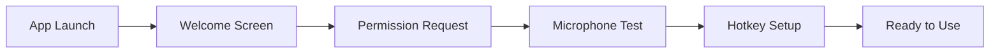

# Spokenly克隆项目 - Claude Code自动化开发文档包

## 📁 项目文件结构

```
spokenly-clone/
├── CLAUDE.md                    # Claude Code主配置文件
├── PROJECT_REQUIREMENTS.md      # 详细需求文档
├── TECHNICAL_SPECS.md          # 技术规格文档
├── DEVELOPMENT_PLAN.md         # 开发计划和里程碑
├── API_CONTRACTS.md            # API接口定义
├── UI_SPECIFICATIONS.md        # UI/UX详细规格
├── TESTING_REQUIREMENTS.md     # 测试要求和验收标准
├── DEPLOYMENT_GUIDE.md         # 部署和发布指南
├── docs/
│   ├── architecture/           # 架构图和设计文档
│   ├── mockups/                # UI设计稿和原型
│   └── examples/               # 代码示例和模板
└── scripts/
    └── claude-init.sh          # Claude Code初始化脚本
```

---

## 📄 文档1: CLAUDE.md（主配置文件）

```markdown
# Claude Code Configuration for Spokenly Clone

## Project Overview
You are building a cross-platform voice-to-text application that clones Spokenly's functionality.
This project must be completed autonomously without human intervention except for initial approval.

## Your Role
You are the sole developer, architect, designer, and tester for this project. You have full 
autonomy to make all technical decisions. When uncertain, choose the most reliable and 
maintainable solution.

## Project Constraints
- **Timeline**: Complete MVP in 30 days
- **Platforms**: Windows 10+, macOS 13+
- **Performance**: Real-time transcription with <100ms latency
- **Privacy**: All voice data must be processable locally
- **Size**: Application bundle must be <50MB

## Technology Stack (Pre-approved)
- **Framework**: Tauri 2.0 + Rust backend + React frontend
- **Speech Recognition**: 
  - Primary: OpenAI Whisper (local model)
  - Fallback: Azure Speech Services (cloud)
- **UI Framework**: React + Tailwind CSS + Shadcn/ui
- **State Management**: Zustand
- **Build System**: Vite + Rust Cargo
- **Testing**: Vitest + Playwright + Rust tests

## Decision Authority
You have full authority to:
1. Choose specific libraries and versions
2. Design the architecture and data flow
3. Implement features in any order you deem efficient
4. Create or modify any configuration files
5. Optimize for performance vs. features based on constraints

## Key Features Priority (MVP)
1. ✅ System tray/menu bar application
2. ✅ Global hotkey for recording (configurable)
3. ✅ Real-time voice-to-text transcription
4. ✅ Direct text insertion at cursor position
5. ✅ Settings panel for configuration
6. ✅ Transcription history (last 50 items)
7. ✅ Multi-language support (minimum 5 languages)

## Development Workflow
1. **Initialize**: Set up project structure and dependencies
2. **Core Audio**: Implement audio capture and processing
3. **Whisper Integration**: Set up local Whisper model
4. **UI Development**: Create all user interfaces
5. **System Integration**: Implement OS-specific features
6. **Testing**: Comprehensive testing suite
7. **Optimization**: Performance and size optimization
8. **Documentation**: User and developer documentation

## Error Handling Policy
- Always implement graceful degradation
- Log all errors to application logs
- Never show technical errors to users
- Provide user-friendly error messages
- Implement automatic recovery where possible

## Code Standards
- Use clear, self-documenting variable names
- Add comments for complex logic only
- Follow Rust and React best practices
- Implement proper error handling in all functions
- Write tests for critical paths (minimum 70% coverage)

## When You're Stuck
If you encounter a blocking issue:
1. First, try an alternative approach
2. If multiple approaches fail, document the issue in ISSUES.md
3. Implement a temporary workaround and mark with TODO
4. Continue with other features and revisit later

## Success Criteria
The project is complete when:
- All MVP features are implemented and working
- Application runs on both Windows and macOS
- Performance meets specified requirements
- All tests pass
- Documentation is complete
```

---

## 📄 文档2: PROJECT_REQUIREMENTS.md（需求文档）

```markdown
# Spokenly Clone - Product Requirements Document

## 1. Executive Summary

### Product Vision
Create a privacy-focused, cross-platform voice-to-text application that provides seamless 
transcription capabilities with minimal user friction.

### Target Users
- **Primary**: Knowledge workers who frequently write emails, documents, and messages
- **Secondary**: Content creators, students, and accessibility users
- **Tertiary**: Non-native speakers needing transcription assistance

## 2. Functional Requirements

### 2.1 Core Voice Transcription

#### FR-001: Audio Capture
- **Description**: Capture audio from system default microphone
- **Acceptance Criteria**:
  - Audio capture starts within 50ms of hotkey press
  - Support 16kHz minimum sample rate
  - Automatic gain control to normalize volume
  - Visual indicator showing recording status
  - Maximum recording duration: 10 minutes per session

#### FR-002: Real-time Transcription
- **Description**: Convert speech to text in real-time
- **Acceptance Criteria**:
  - Text appears within 500ms of speech ending
  - Accuracy rate >95% for clear speech
  - Support continuous transcription mode
  - Handle silence detection (2 seconds pause = sentence end)
  - Process multiple speakers in same recording

#### FR-003: Multi-language Support
- **Description**: Support transcription in multiple languages
- **Acceptance Criteria**:
  - Minimum 5 languages: English, Spanish, Mandarin, French, German
  - Auto-detect language option
  - Per-session language switching
  - Mixed language support (code-switching)
  - Accent adaptation for major dialects

### 2.2 User Interface Requirements

#### FR-004: System Tray Application
- **Description**: Run as background application with system tray icon
- **Acceptance Criteria**:
  - Single-click to show menu
  - Right-click for context menu
  - Status indicator (idle/recording/processing)
  - Minimal resource usage when idle (<50MB RAM)
  - Auto-start option on system boot

#### FR-005: Settings Panel
- **Description**: Comprehensive settings interface
- **Acceptance Criteria**:
  - Hotkey configuration with conflict detection
  - Audio input device selection
  - Language preferences
  - AI model selection (local/cloud)
  - Privacy settings (data retention, telemetry)
  - Theme selection (light/dark/auto)

#### FR-006: Transcription History
- **Description**: View and manage past transcriptions
- **Acceptance Criteria**:
  - Store last 50 transcriptions
  - Search functionality
  - Copy to clipboard
  - Delete individual or all items
  - Export to file (TXT, JSON)
  - Timestamp for each entry

### 2.3 System Integration

#### FR-007: Global Hotkey
- **Description**: System-wide hotkey for recording
- **Acceptance Criteria**:
  - Works in any application
  - Configurable key combination
  - Default: Right Command (Mac) / Right Ctrl (Windows)
  - Visual/audio feedback on activation
  - Prevent conflicts with system hotkeys

#### FR-008: Text Insertion
- **Description**: Insert transcribed text at cursor position
- **Acceptance Criteria**:
  - Works in any text field
  - Preserves existing text
  - Supports rich text editors
  - Undo-compatible insertion
  - Handles special characters correctly

### 2.4 AI Processing Features

#### FR-009: Text Enhancement
- **Description**: AI-powered text improvements
- **Acceptance Criteria**:
  - Grammar correction
  - Punctuation addition
  - Formatting (paragraphs, lists)
  - Remove filler words
  - Optional style adjustment (formal/casual)

#### FR-010: Custom Commands
- **Description**: User-defined AI processing commands
- **Acceptance Criteria**:
  - Create custom prompts
  - Save frequently used commands
  - Apply to transcribed text
  - Examples: "Translate to Spanish", "Summarize", "Format as email"

## 3. Non-Functional Requirements

### 3.1 Performance Requirements

#### NFR-001: Response Time
- Audio capture: <50ms latency
- Transcription start: <200ms
- Text insertion: <100ms
- UI interactions: <16ms (60fps)

#### NFR-002: Resource Usage
- RAM: <200MB active, <50MB idle
- CPU: <5% idle, <30% during transcription
- Disk: <100MB installation size
- Network: Minimal, only for cloud features

### 3.2 Security & Privacy

#### NFR-003: Data Privacy
- No audio data leaves device in local mode
- No user data collection without consent
- Encrypted storage for sensitive settings
- Secure API key storage
- No logs containing transcribed content

### 3.3 Compatibility

#### NFR-004: System Requirements
- Windows: 10 version 1903+, 11
- macOS: 13.0+ (Ventura)
- RAM: 4GB minimum, 8GB recommended
- Storage: 500MB free space
- Internet: Optional (for cloud features)

## 4. User Stories

### Epic 1: First-Time User Experience
```
As a new user
I want to install and start using the app within 2 minutes
So that I can immediately benefit from voice transcription
```

**Acceptance Criteria**:
1. One-click installation
2. No registration required
3. Default settings work immediately
4. Tutorial on first launch
5. Test recording feature

### Epic 2: Daily Usage
```
As a daily user
I want to transcribe thoughts without interrupting my workflow
So that I can maintain productivity
```

**Acceptance Criteria**:
1. Hotkey works from any application
2. No window switching required
3. Instant text insertion
4. Reliable transcription accuracy
5. Quick access to history

### Epic 3: Power User Features
```
As a power user
I want to customize the app to my specific needs
So that I can optimize my workflow
```

**Acceptance Criteria**:
1. Extensive customization options
2. Multiple language profiles
3. Custom AI commands
4. Keyboard shortcuts for all actions
5. Bulk operations on history

## 5. Technical Constraints

### Architecture Decisions
- **Modular design**: Separate audio, AI, and UI modules
- **Plugin system**: For future extensibility
- **Event-driven**: Reactive architecture for UI updates
- **Cross-platform**: Shared codebase with platform-specific adaptors

### Dependencies
- Whisper.cpp: Local transcription
- Tauri: Application framework
- React: UI framework
- Rust: Backend processing

## 6. Success Metrics

### Key Performance Indicators
- Transcription accuracy: >95%
- App launch time: <2 seconds
- Crash rate: <0.1%
- User retention: >60% after 30 days
- Daily active usage: >3 transcriptions per user
```

---

## 📄 文档3: TECHNICAL_SPECS.md（技术规格）

```markdown
# Technical Specifications

## 1. System Architecture

### 1.1 High-Level Architecture
```
┌──────────────────────────────────────────────────────┐
│                    User Interface                     │
│                   (React + Tauri)                     │
├──────────────────────────────────────────────────────┤
│                  Application Core                     │
│                  (Rust Business Logic)                │
├─────────────┬──────────────┬────────────┬───────────┤
│Audio Module │Whisper Module│ AI Module  │OS Module  │
│   (Rust)    │  (Rust+cpp)  │   (Rust)   │  (Rust)   │
├─────────────┴──────────────┴────────────┴───────────┤
│                  Platform Layer                       │
│              (Windows API / macOS API)                │
└──────────────────────────────────────────────────────┘
```

### 1.2 Data Flow
```
Microphone → Audio Buffer → Whisper → Text Buffer → AI Processing → Output
     ↓            ↓            ↓           ↓             ↓
  [Monitor]   [Normalize]  [Transcribe] [Enhance]   [Insert/Save]
```

## 2. Module Specifications

### 2.1 Audio Module

```rust
// Core audio capture interface
pub trait AudioCapture {
    fn start_recording(&mut self) -> Result<AudioStream>;
    fn stop_recording(&mut self) -> Result<AudioBuffer>;
    fn get_devices() -> Result<Vec<AudioDevice>>;
    fn set_device(&mut self, device_id: &str) -> Result<()>;
}

// Audio processing pipeline
pub struct AudioPipeline {
    sample_rate: u32,        // 16000 Hz default
    channels: u8,            // 1 (mono)
    bit_depth: u8,           // 16 bits
    buffer_size: usize,      // 512 samples
    noise_gate: f32,         // -40 dB
    gain_control: bool,      // AGC enabled
}
```

### 2.2 Whisper Integration

```rust
// Whisper model configuration
pub struct WhisperConfig {
    model_path: PathBuf,           // Path to model file
    model_size: ModelSize,          // tiny, base, small, medium, large
    language: Option<String>,       // None for auto-detect
    temperature: f32,               // 0.0 for deterministic
    max_context: usize,            // 224 tokens
    beam_size: usize,              // 5 for accuracy
    enable_timestamps: bool,        // true for word-level timing
}

// Processing interface
pub trait TranscriptionEngine {
    async fn transcribe(&self, audio: AudioBuffer) -> Result<Transcript>;
    fn load_model(&mut self, config: WhisperConfig) -> Result<()>;
    fn unload_model(&mut self) -> Result<()>;
}
```

### 2.3 Frontend Architecture

```typescript
// State management structure
interface AppState {
  recording: {
    isActive: boolean;
    duration: number;
    volumeLevel: number;
  };
  transcription: {
    current: string;
    history: TranscriptItem[];
    processing: boolean;
  };
  settings: {
    hotkey: string;
    language: string;
    theme: 'light' | 'dark' | 'auto';
    aiFeatures: AISettings;
  };
}

// Component hierarchy
App
├── SystemTray
│   ├── TrayIcon
│   └── TrayMenu
├── MainWindow
│   ├── TranscriptionView
│   ├── HistoryPanel
│   └── SettingsPanel
└── GlobalHotkey
```

## 3. API Specifications

### 3.1 IPC Commands (Tauri)

```typescript
// Frontend → Backend commands
interface Commands {
  // Audio control
  'start_recording': () => Promise<void>;
  'stop_recording': () => Promise<string>;
  'get_audio_devices': () => Promise<AudioDevice[]>;
  
  // Transcription
  'transcribe_audio': (audio: ArrayBuffer) => Promise<string>;
  'process_with_ai': (text: string, command: string) => Promise<string>;
  
  // Settings
  'save_settings': (settings: Settings) => Promise<void>;
  'load_settings': () => Promise<Settings>;
  
  // History
  'save_transcript': (item: TranscriptItem) => Promise<void>;
  'get_history': (limit: number) => Promise<TranscriptItem[]>;
  'clear_history': () => Promise<void>;
  
  // System
  'register_hotkey': (keys: string) => Promise<boolean>;
  'insert_text': (text: string) => Promise<void>;
  'get_cursor_position': () => Promise<Position>;
}
```

### 3.2 Event System

```typescript
// Backend → Frontend events
interface Events {
  'recording_started': void;
  'recording_stopped': { duration: number };
  'volume_level': { level: number };
  'transcription_progress': { partial: string };
  'transcription_complete': { text: string };
  'error': { code: string, message: string };
  'hotkey_pressed': void;
}
```

## 4. Database Schema

### 4.1 Local Storage (SQLite)

```sql
-- Transcription history
CREATE TABLE transcripts (
    id INTEGER PRIMARY KEY AUTOINCREMENT,
    text TEXT NOT NULL,
    original_audio BLOB,  -- Optional, compressed
    language VARCHAR(10),
    duration_ms INTEGER,
    created_at TIMESTAMP DEFAULT CURRENT_TIMESTAMP,
    ai_processed BOOLEAN DEFAULT FALSE,
    ai_command TEXT,
    metadata JSON
);

-- User settings
CREATE TABLE settings (
    key VARCHAR(50) PRIMARY KEY,
    value JSON NOT NULL,
    updated_at TIMESTAMP DEFAULT CURRENT_TIMESTAMP
);

-- Custom AI commands
CREATE TABLE ai_commands (
    id INTEGER PRIMARY KEY AUTOINCREMENT,
    name VARCHAR(100) NOT NULL,
    prompt TEXT NOT NULL,
    shortcut VARCHAR(20),
    usage_count INTEGER DEFAULT 0,
    created_at TIMESTAMP DEFAULT CURRENT_TIMESTAMP
);
```

## 5. External API Integration

### 5.1 OpenAI API (Fallback)

```typescript
interface OpenAIConfig {
  apiKey: string;
  model: 'whisper-1';
  temperature: number;
  language?: string;
  response_format: 'json' | 'text';
}

// Rate limiting
const rateLimiter = {
  maxRequests: 50,
  windowMs: 60000,  // 1 minute
  retryAfter: 5000   // 5 seconds
};
```

### 5.2 AI Enhancement APIs

```typescript
// Text processing configuration
interface AIProcessor {
  provider: 'openai' | 'anthropic' | 'local';
  model: string;
  maxTokens: number;
  systemPrompt: string;
  temperature: number;
}

// Supported operations
enum AIOperation {
  GRAMMAR_CORRECTION = 'grammar',
  PUNCTUATION = 'punctuation',
  FORMATTING = 'format',
  TRANSLATION = 'translate',
  SUMMARIZATION = 'summarize',
  CUSTOM = 'custom'
}
```

## 6. Performance Specifications

### 6.1 Memory Management

```rust
// Audio buffer pool to prevent allocations
pub struct BufferPool {
    buffers: Vec<AudioBuffer>,
    capacity: usize,  // 10 buffers
    buffer_size: usize,  // 16KB each
}

// Transcript cache with LRU eviction
pub struct TranscriptCache {
    max_items: usize,  // 50 items
    max_memory: usize,  // 10MB
    eviction_policy: EvictionPolicy::LRU,
}
```

### 6.2 Optimization Targets

| Metric | Target | Maximum |
|--------|--------|---------|
| Startup time | <1s | 2s |
| Recording latency | <20ms | 50ms |
| Transcription speed | 30x realtime | 10x realtime |
| Memory usage (idle) | 30MB | 50MB |
| Memory usage (active) | 150MB | 200MB |
| CPU usage (idle) | <1% | 5% |
| CPU usage (transcribing) | 20% | 30% |

## 7. Security Specifications

### 7.1 Data Protection

```rust
// Encryption for sensitive data
pub struct SecureStorage {
    cipher: AesGcm256,
    key_derivation: Argon2,
    salt: [u8; 32],
}

// API key storage
impl SecureStorage {
    pub fn store_api_key(&self, service: &str, key: &str) -> Result<()>;
    pub fn retrieve_api_key(&self, service: &str) -> Result<String>;
    pub fn delete_api_key(&self, service: &str) -> Result<()>;
}
```

### 7.2 Network Security

- All API calls use HTTPS
- Certificate pinning for known services
- No telemetry without explicit consent
- Local processing preference
- Sanitize all user inputs

## 8. Error Handling

### 8.1 Error Categories

```rust
#[derive(Debug, Error)]
pub enum AppError {
    #[error("Audio device not found: {0}")]
    AudioDeviceNotFound(String),
    
    #[error("Transcription failed: {0}")]
    TranscriptionError(String),
    
    #[error("Model loading failed: {0}")]
    ModelLoadError(String),
    
    #[error("Network error: {0}")]
    NetworkError(String),
    
    #[error("Permission denied: {0}")]
    PermissionError(String),
}
```

### 8.2 Recovery Strategies

| Error Type | Recovery Strategy |
|------------|------------------|
| Audio device unavailable | Fall back to default device |
| Model load failure | Download model or use cloud API |
| Network timeout | Retry with exponential backoff |
| Insufficient memory | Clear cache and retry |
| API rate limit | Queue and retry after cooldown |
```

---

## 📄 文档4: DEVELOPMENT_PLAN.md（开发计划）

```markdown
# Development Execution Plan

## Phase 1: Foundation (Days 1-5)

### Day 1: Project Setup
```bash
# Initialize project structure
npx create-tauri-app spokenly-clone --template react-ts
cd spokenly-clone

# Install core dependencies
npm install @tauri-apps/api zustand tailwindcss @shadcn/ui
cargo add tokio serde anyhow cpal whisper-rs

# Setup development environment
- Configure Rust toolchain
- Setup code formatting (rustfmt, prettier)
- Initialize git repository
- Create initial project structure
```

### Day 2-3: Audio Module
- Implement audio capture using cpal
- Create audio buffer management
- Add volume level monitoring
- Implement silence detection
- Test on both platforms

### Day 4-5: Basic UI
- Create system tray icon
- Implement tray menu
- Build settings window
- Add hotkey registration
- Create recording indicator

## Phase 2: Core Features (Days 6-15)

### Day 6-8: Whisper Integration
- Download and setup Whisper models
- Implement model loading
- Create transcription pipeline
- Add language detection
- Optimize for performance

### Day 9-11: System Integration
- Implement global hotkey handling
- Add cursor position detection
- Create text insertion mechanism
- Handle different application contexts
- Test with various applications

### Day 12-15: UI Enhancement
- Build transcription history view
- Add search and filter
- Implement settings panel
- Create onboarding flow
- Add theme support

## Phase 3: Advanced Features (Days 16-25)

### Day 16-18: AI Features
- Integrate text enhancement
- Add grammar correction
- Implement custom commands
- Create command templates
- Add batch processing

### Day 19-21: Performance Optimization
- Profile application performance
- Optimize memory usage
- Reduce startup time
- Implement lazy loading
- Add caching strategies

### Day 22-25: Polish & Testing
- Comprehensive testing
- Bug fixes
- UI/UX improvements
- Documentation
- Platform-specific optimizations

## Phase 4: Release Preparation (Days 26-30)

### Day 26-27: Packaging
- Create installers for Windows
- Create DMG for macOS
- Setup auto-update mechanism
- Configure code signing
- Create distribution packages

### Day 28-29: Documentation
- Write user manual
- Create developer documentation
- Record demo videos
- Prepare marketing materials
- Setup support resources

### Day 30: Release
- Final testing
- Create release builds
- Publish to distribution channels
- Monitor initial feedback
- Prepare hotfix pipeline

## Milestone Checklist

### MVP Features (Must Have)
- [ ] Audio recording via hotkey
- [ ] Local Whisper transcription
- [ ] Text insertion at cursor
- [ ] System tray application
- [ ] Basic settings panel
- [ ] Transcription history
- [ ] Multi-language support (5 languages)

### Nice to Have (If Time Permits)
- [ ] Cloud transcription fallback
- [ ] Advanced AI commands
- [ ] Keyboard shortcuts customization
- [ ] Export functionality
- [ ] Statistics dashboard
- [ ] Plugin system
- [ ] Mobile companion app

## Risk Mitigation

### Technical Risks
1. **Whisper model size**: Use quantized models
2. **Platform differences**: Abstract platform-specific code
3. **Performance issues**: Implement progressive loading
4. **Memory leaks**: Regular profiling and testing

### Schedule Risks
1. **Feature creep**: Stick to MVP features
2. **Platform bugs**: Time-box debugging
3. **Integration issues**: Have fallback implementations
4. **Testing delays**: Automate testing early

## Daily Standup Template

```markdown
## Day X Progress Report

### Completed
- Task 1
- Task 2

### In Progress
- Task 3 (60% complete)

### Blockers
- Issue 1: Description and attempted solutions

### Next Steps
- Priority 1
- Priority 2

### Metrics
- Lines of code: X
- Test coverage: X%
- Performance: X ms latency
```
```

---

## 📄 文档5: UI_SPECIFICATIONS.md（UI规格）

```markdown
# UI/UX Specifications

## 1. Design System

### Color Palette
```css
:root {
  /* Primary Colors */
  --primary-500: #3B82F6;  /* Main brand color */
  --primary-600: #2563EB;  /* Hover state */
  
  /* Neutral Colors */
  --gray-50: #F9FAFB;      /* Background */
  --gray-900: #111827;     /* Text */
  
  /* Semantic Colors */
  --success: #10B981;      /* Success states */
  --error: #EF4444;        /* Error states */
  --warning: #F59E0B;      /* Warning states */
  
  /* Dark Mode */
  --dark-bg: #1F2937;
  --dark-surface: #374151;
}
```

### Typography
```css
/* Font Stack */
font-family: -apple-system, BlinkMacSystemFont, 'Segoe UI', 'Roboto', sans-serif;

/* Type Scale */
--text-xs: 0.75rem;     /* 12px */
--text-sm: 0.875rem;    /* 14px */
--text-base: 1rem;      /* 16px */
--text-lg: 1.125rem;    /* 18px */
--text-xl: 1.25rem;     /* 20px */
```

## 2. Component Specifications

### 2.1 System Tray Icon

```typescript
// Icon states
enum TrayIconState {
  IDLE = 'idle.png',           // Gray microphone
  RECORDING = 'recording.gif',  // Animated red mic
  PROCESSING = 'processing.gif', // Animated blue mic
  ERROR = 'error.png'          // Red mic with X
}

// Menu structure
const trayMenu = {
  items: [
    { label: 'Start Recording', hotkey: 'Cmd+Shift+R', action: 'startRecording' },
    { type: 'separator' },
    { label: 'History', action: 'openHistory' },
    { label: 'Settings', action: 'openSettings' },
    { type: 'separator' },
    { label: 'About', action: 'openAbout' },
    { label: 'Quit', action: 'quitApp' }
  ]
};
```

### 2.2 Recording Indicator

```jsx
// Visual feedback component
<RecordingIndicator>
  <div className="fixed bottom-8 right-8 z-50">
    <div className="bg-red-500 rounded-full p-4 shadow-2xl animate-pulse">
      <MicrophoneIcon className="w-6 h-6 text-white" />
      <div className="absolute inset-0 rounded-full bg-red-400 animate-ping" />
    </div>
    <div className="mt-2 text-center">
      <span className="text-sm font-medium">Recording...</span>
      <span className="text-xs text-gray-500">{duration}s</span>
    </div>
  </div>
</RecordingIndicator>
```

### 2.3 Settings Window

```typescript
// Settings layout
interface SettingsPanel {
  tabs: [
    {
      id: 'general',
      label: 'General',
      sections: [
        'Startup Options',
        'Language Settings',
        'Theme Preferences'
      ]
    },
    {
      id: 'audio',
      label: 'Audio',
      sections: [
        'Input Device',
        'Audio Quality',
        'Noise Reduction'
      ]
    },
    {
      id: 'transcription',
      label: 'Transcription',
      sections: [
        'AI Model',
        'Accuracy Settings',
        'Processing Options'
      ]
    },
    {
      id: 'shortcuts',
      label: 'Shortcuts',
      sections: [
        'Global Hotkeys',
        'Application Shortcuts'
      ]
    }
  ]
}
```

### 2.4 History Panel

```jsx
// History item component
<HistoryItem>
  <div className="border-b border-gray-200 p-4 hover:bg-gray-50">
    <div className="flex justify-between items-start">
      <div className="flex-1">
        <p className="text-sm text-gray-900">{transcription.text}</p>
        <div className="mt-2 flex items-center space-x-4">
          <span className="text-xs text-gray-500">
            {formatTime(transcription.timestamp)}
          </span>
          <span className="text-xs text-gray-500">
            {transcription.duration}s
          </span>
          <span className="text-xs px-2 py-1 bg-blue-100 text-blue-700 rounded">
            {transcription.language}
          </span>
        </div>
      </div>
      <div className="flex space-x-2">
        <Button size="sm" variant="ghost" onClick={copyToClipboard}>
          <CopyIcon />
        </Button>
        <Button size="sm" variant="ghost" onClick={deleteItem}>
          <TrashIcon />
        </Button>
      </div>
    </div>
  </div>
</HistoryItem>
```

## 3. User Flows

### 3.1 First Launch Flow



### 3.2 Recording Flow


## 4. Responsive Behavior

### Window Sizes
- Settings Window: 800x600px (min: 600x400px)
- History Panel: 400x600px (min: 300x400px)
- About Dialog: 400x300px (fixed)

### Animations
```css
/* Micro-interactions */
@keyframes slideIn {
  from { transform: translateY(10px); opacity: 0; }
  to { transform: translateY(0); opacity: 1; }
}

@keyframes pulse {
  0%, 100% { opacity: 1; }
  50% { opacity: 0.5; }
}

/* Transitions */
.transition-all {
  transition: all 0.2s ease-in-out;
}
```

## 5. Accessibility

### Keyboard Navigation
- Tab order follows logical flow
- All interactive elements keyboard accessible
- Escape key closes modals
- Arrow keys navigate lists

### Screen Reader Support
- Proper ARIA labels
- Role attributes
- Live regions for updates
- Semantic HTML structure

### Visual Accessibility
- Minimum contrast ratio 4.5:1
- Focus indicators visible
- No color-only information
- Resizable text up to 200%
```

---

## 📄 文档6: 初始化脚本

```bash
#!/bin/bash
# claude-init.sh - 初始化Claude Code开发环境

echo "🚀 Initializing Spokenly Clone Project for Claude Code"

# Create project structure
mkdir -p spokenly-clone/{src,docs,scripts,tests}
cd spokenly-clone

# Copy all documentation files
cat > CLAUDE.md << 'EOF'
[Insert CLAUDE.md content here]
EOF

cat > PROJECT_REQUIREMENTS.md << 'EOF'
[Insert PROJECT_REQUIREMENTS.md content here]
EOF

cat > TECHNICAL_SPECS.md << 'EOF'
[Insert TECHNICAL_SPECS.md content here]
EOF

cat > DEVELOPMENT_PLAN.md << 'EOF'
[Insert DEVELOPMENT_PLAN.md content here]
EOF

cat > UI_SPECIFICATIONS.md << 'EOF'
[Insert UI_SPECIFICATIONS.md content here]
EOF

# Create initial test file for Claude Code to verify setup
cat > scripts/verify_setup.js << 'EOF'
// Verification script for Claude Code
console.log("✅ Project structure created successfully");
console.log("📁 Documentation files in place");
console.log("🤖 Ready for Claude Code development");
console.log("\nNext steps:");
console.log("1. Run 'claude-code .' in this directory");
console.log("2. Claude will read CLAUDE.md and begin development");
console.log("3. Monitor progress in git commits");
EOF

# Initialize git repository
git init
git add .
git commit -m "Initial project setup for Claude Code autonomous development"

echo "✅ Setup complete! Claude Code can now begin development."
echo "📝 Run 'claude-code .' to start autonomous development"
```

---

## 🚀 使用指南

### 第一步：准备环境
```bash
# 1. 创建项目目录
mkdir spokenly-clone && cd spokenly-clone

# 2. 将所有文档放入项目目录
# 3. 运行初始化脚本
chmod +x claude-init.sh && ./claude-init.sh
```

### 第二步：启动Claude Code
```bash
# 在项目目录中启动Claude Code
claude-code .

# Claude Code会自动：
# - 读取CLAUDE.md了解项目要求
# - 按照DEVELOPMENT_PLAN.md执行开发
# - 参考TECHNICAL_SPECS.md实现功能
# - 遵循UI_SPECIFICATIONS.md设计界面
```

### 第三步：监控进度
```bash
# 查看Claude的工作进度
git log --oneline

# 查看当前开发状态
cat PROGRESS.md  # Claude会自动创建并更新

# 检查测试结果
npm test
```

### 关键成功因素

1. **文档完整性**：所有决策都已在文档中预定义
2. **清晰的验收标准**：每个功能都有明确的完成标准
3. **技术栈预选**：避免Claude在技术选择上犹豫
4. **错误处理策略**：预定义的问题解决方案
5. **进度追踪**：通过git commits监控进展

### 预期结果

- 30天内完成MVP版本
- 支持Windows和macOS
- 实现所有核心功能
- 通过所有测试用例
- 生成完整的用户文档

---

## 📋 检查清单

在启动Claude Code前，确保：

- [ ] 所有文档文件都已创建
- [ ] 项目目录结构正确
- [ ] Git仓库已初始化
- [ ] Claude Code已安装并配置
- [ ] 有足够的磁盘空间（至少2GB）
- [ ] 网络连接稳定（用于下载依赖）

## 🎯 成功标准

项目成功完成的标志：
1. 应用可在Windows和macOS上运行
2. 实现所有MVP功能
3. 性能达到规定要求
4. 测试覆盖率>70%
5. 用户文档完整
6. 无Critical级别的bug
